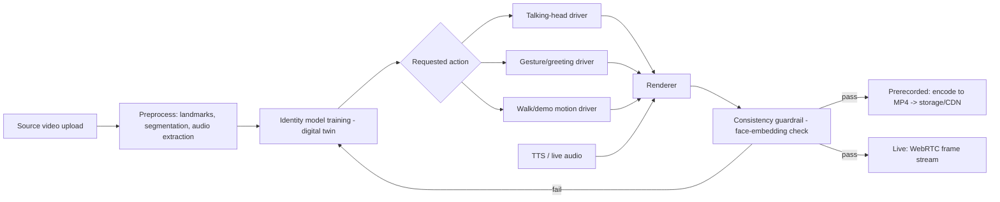
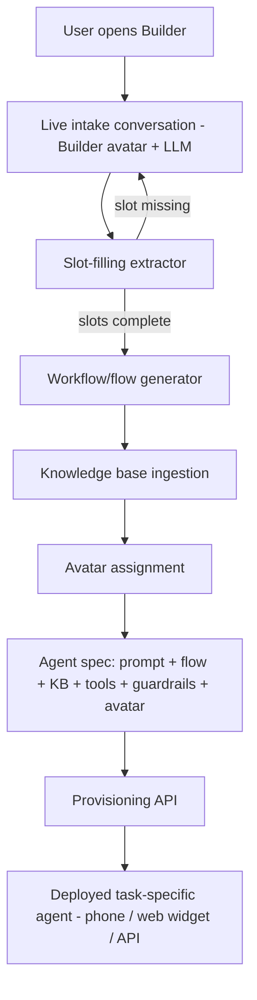

# AI Avatar & Agent Platform — R&D and Implementation Plan

## Executive Summary

We're building two connected products — a Tavus/HeyGen-style avatar video engine (prerecorded and live) and a live conversational "Agent Builder" that turns a spoken requirement into a deployed task-specific voice/video agent — and this document is the full R&D, architecture, and staffing plan for both.

**Headline finding from the deep-dive research:** Tavus and HeyGen independently arrived at the same architectural template — a proprietary, in-house-trained avatar-rendering model (Tavus's Phoenix, HeyGen's Avatar IV/V) layered on top of a bought, third-party real-time transport (Tavus on Daily.co, HeyGen on LiveKit) and bought STT/TTS providers. Neither vendor built its own WebRTC stack. That validates our own Tech Stack recommendation below: concentrate engineering effort on the avatar-consistency model and conversation orchestration; buy the transport and speech layers.

**The single biggest open gap in the market — and our clearest differentiation opportunity:** neither Tavus nor HeyGen has unified one avatar across prerecorded and live use — HeyGen explicitly states its Studio and LiveAvatar models are separately trained and not cross-compatible, and Tavus doesn't claim otherwise. Our Product Vision (one shared identity/rendering core behind both modes) targets exactly this gap, and it's the top item to validate empirically in the Phase 1 POC.

**Both vendors also validate the second half of our plan**: Tavus's PAL Maker and HeyGen's Video Agent are shipped, real precedents for "describe it, get an agent/video," but neither discloses how the conversation is turned into a concrete configuration — that logic is whitespace we have to design ourselves (see the Agent Builder architecture below).

**Recommendation:** proceed with the three-track build plan below (Avatar & Video Generation Pipeline / Live Agent Builder & Orchestration / Platform Infrastructure & Front-end), each running a 4–6 week Phase 1 POC in parallel, alongside a short vendor POC trialing Tavus and HeyGen directly on a Hindi/Kannada sample script — both to de-risk the still-unverified Indic-language question fast, and to give our own build a concrete quality bar to beat before committing further budget.

---

## Product Vision & Scope

This is two connected products, not one — the same split the market itself shows (no single vendor does both well).

**1. Avatar Generation Platform (Tavus + HeyGen-style, merged).** A user uploads a short reference video of themselves (or a hired presenter). The platform trains a reusable "digital twin" from it and can then generate new videos of that exact person performing arbitrary requested actions — speaking a new script, greeting, walking, demonstrating a product — from text or audio input alone, in two output modes:
- *Prerecorded mode* (HeyGen/Synthesia-style): script or slide deck in, a finished MP4 lesson/marketing/demo video out.
- *Live mode* (Tavus/Anam-style): the same twin driven in real time inside a two-way voice/video conversation.

Both modes share one identity/rendering core so the avatar never drifts in appearance and never introduces a second character, regardless of which mode generated it.

**2. Live Conversational Agent Builder.** A live voice/video AI agent interviews a user in natural conversation, extracts their business requirement — e.g. *"I need an agent that receives calls from HR teams, understands job and candidate requirements, communicates with them, and helps complete the placement process"* — and automatically assembles a dedicated, deployable, task-specific AI agent: its knowledge base, conversation flow/objectives, guardrails, tool/API integrations, and an avatar drawn from Product 1.

**How the two connect.** The Agent Builder is the front door: every agent it produces is configured with an avatar (the requester's own twin, or a stock one) rendered by Product 1's live-mode engine, and is deployed as a standing voice/video agent a third party (e.g. an HR caller) can call into. Product 1 is the shared identity and rendering layer that both authored lesson content and every builder-generated agent draw from — one avatar engine, two consumption modes (watch a video / talk to it live), plus one meta-agent (the Builder) that configures new specialized agents on demand.

---

## Tavus — Full Technical Research

Sourcing key: **[V]** vendor-documented, **[3P]** third-party, **[INF]** inference.

### Company & core products
San Francisco AI research company ("The Human Computing Company"), ~$64.2M raised across seed/Series A (Sequoia, YC, Scale Venture Partners, CRV) [3P estimate]. Core stack: **Phoenix** (avatar/replica rendering model, currently Phoenix-4/4.5), **CVI** (Conversational Video Interface — the real-time pipeline product), **Raven** (multimodal perception layer), **Sparrow** (turn-taking model), **PAL Maker** (no-code conversational agent builder — Tavus's own version of our "describe it, get an agent" concept), a separate async script/audio-to-video API, plus Memories/Knowledge Base/Objectives/Guardrails as persona add-ons. [V]

### Avatar / digital-twin creation
- Input: a 1–2 minute training video (documented length is inconsistent across Tavus's own docs) **or** a single photo (faster, voice attached separately). Training requires **mandatory on-camera verbal consent** (a specific spoken consent statement, audio-matched). Custom replica training is gated to paid plans only. [V]
- Turnaround is inconsistently documented: a watermarked preview in ~1 minute (photo) to a few minutes (video), but full/production training reported elsewhere as 4–5 hours or 24–72 hours [3P, conflicting] — **validate empirically, don't take one figure as SLA-ready**.
- Architecture (self-disclosed): Phoenix-1 combined a 3D Morphable Model + NeRF + 2D GAN refinement + audio-driven animation, with **per-replica fine-tuning** of a shared base model (not a universal one-shot encoder). Phoenix-4 replaced NeRF with **3D Gaussian Splatting** driven by an implicit learned behavioral model, rendering the full head (not a cropped mouth patch) — explicitly framed by Tavus as their answer to identity drift. Phoenix-4 layers a diffusion process ("Gaussian-diffusion") on top for per-frame motion/appearance. [V]
- Claimed performance: 40 FPS at 1080p, "134ms audio-to-video," "sub-600ms" end-to-end (Phoenix-4.5) — **unverified vendor marketing, no independent benchmark found**.
- **[INF]** Net design choice: consistency comes from fine-tuning a dedicated model per person (costs real training time) rather than a fast universal one-shot method — a direct trade-off to weigh against our own identity-model approach.

### Real-time pipeline (CVI)
A documented **six-layer pipeline**: Perception (Raven) → turn-taking (Sparrow) → STT → LLM → TTS → avatar rendering (Phoenix). [V]
- **Transport: built on Daily.co's hosted WebRTC** (a formal partnership, not in-house media infra), embeddable via Daily's iframe/Prebuilt UI or Call Object SDK; also integrates with Daily's open-source **Pipecat** agent framework. [V/3P]
- **STT**: configurable per persona — Deepgram, Azure, Whisper, or Tavus's own auto-router (`tavus-auto`, default).
- **LLM**: Tavus-hosted options churn over time; **BYO-LLM is first-class** via any OpenAI-compatible endpoint. Tavus warns context should stay **under ~5,000 tokens** for best responsiveness, degrading noticeably past 15,000–20,000 — a hard constraint on RAG-heavy or long-system-prompt agents.
- **TTS**: Cartesia (default), ElevenLabs, or Azure (required for languages outside the 42-language auto-set).
- **Turn-taking (Sparrow)**: frame-level floor-ownership prediction (25fps, 40ms windows) with a two-threshold hysteresis scheme to avoid false starts/interruptions; Sparrow-2 claims (self-reported, unverified) 92.4% end-of-turn recall and 97.4% interruption recall.
- Published latency: "<500ms end-to-end" marketing claim, caveated to good network conditions and **entirely dependent on which LLM is plugged in via BYO-LLM** — no independent benchmark exists.

### API & integration workflow
REST API (`tavusapi.com/v2`). End-to-end flow: (1) `POST /v2/replicas` to train a digital twin → (2) `POST /v2/personas` to configure system prompt, pipeline layers, guardrails, objectives, knowledge base → (3) create a **Conversation** (replica + persona) → returns a joinable WebRTC room → (4) embed via Daily SDK. Plus: **Knowledge Base** (PDF/TXT/DOCX/PPTX/CSV/XLSX/URLs, ~5–10 min ingestion, but **English-only — a material gap for an Indic-language platform**); **Objectives & Guardrails** (goal-driven branching + hard behavioral limits, API-only, not in the no-code UI); **Memories** (async cross-session profile/timeline, limited to a single participant tag); **function calling** (e.g. writing back to an ATS mid-call — directly analogous to our HR-placement scenario); **webhooks** on conversation end; and a **separate async `POST /v2/videos` endpoint** for script/audio-to-video generation, queue-based with webhook notification, no published turnaround SLA. [V]

**PAL Maker** is Tavus's own shipped version of our Agent Builder concept: a conversational assistant ("Charlie") that turns a described need into a deployed Face+Voice+prompt+capability agent — validates the pattern, but Tavus discloses **zero architectural detail** on how Charlie converts conversation into config, so that remains whitespace we have to solve ourselves either way.

### Concurrency & pricing (current, from tavus.io/pricing)

| Plan | Included conversation minutes/mo | Max concurrent conversations | Custom replica trainings included | Overage |
| --- | --- | --- | --- | --- |
| Basic (free) | 25 min | 1 | 0 | $65/extra training |
| Starter ($59/mo) | 100 min | 3 | 3/mo | $0.37/min; $65/extra training |
| Growth ($397/mo) | 1,250 min | 10 | 7/mo | $0.32/min; $40/extra training |
| Enterprise | Custom | Custom | Unlimited | Volume-discounted |

Billing mechanics: metered in **6-second increments with a 30-second minimum charge per call**; a "conversation minute" is **full wall-clock session time (connect to disconnect)**, not just active speaking — idle/listening time bills too. Replica training is billed separately from conversation minutes.

### Known limitations & developer feedback
- HN "Show HN" thread feedback: latency praised as better than typical videoconferencing, but also unnatural head-nodding, mouth/teeth rendering "weirdness," **persistent mispronunciation of non-English names despite correction** (directly relevant risk for Indian names), and pre-Sparrow-2 turn-taking complaints. [3P]
- A documented reliability incident: avatars "twitching"/going unresponsive under a traffic surge, publicly attributed by a Tavus employee to capacity overload. [3P]
- G2 reviews (thin sample): onboarding bugs taking over a month to resolve. [3P, low confidence]
- Hard documented constraints: Knowledge Base is English-only; LLM context ceiling (~5k tokens ideal); Memories support only one participant tag; the persona greeting **cannot be interrupted**; background customization is incompatible with Phoenix-4.5 faces; declaring STT/TTS engines that don't cover every declared language causes a hard call-rejection error. [V]
- No rigorous published "avatar consistency drift across many generations" study exists for Tavus specifically — best answered by our own hands-on POC.

### Engineering stack inference
Job postings show distinct Infrastructure, Frontend, and CVI-specific engineering tracks plus a Forward-Deployed Engineer role; company describes itself as doing in-house ML research on perception/rendering/turn-taking specifically, while transport (Daily), STT (Deepgram/Azure/Whisper) and TTS (Cartesia/ElevenLabs/Azure) are kept as swappable partner layers. **[INF]** Reusable template for us: concentrate engineering effort on the identity/rendering model and turn-taking/perception layer; buy transport and STT/TTS.

---

## HeyGen — Full Technical Research

Same sourcing key: **[V]** vendor-documented, **[3P]** third-party, **[INF]** inference.

### Company & core products
LA-based, founded 2020 (as "Movio"), ~$500M valuation (2024 Series A/B led by Benchmark), reported ARR grew ~$100M (2025) → ~$200M (mid-2026). Acquired Genova Labs (Sept 2025), feeding directly into **Video Agent** (single-prompt idea-to-finished-video). [3P] Product line **[V]**: **Studio** (prerecorded, script/PPT/PDF → MP4), avatar engines branded by version — **Avatar III** (older/cheap/stable), **Avatar IV** (photo-driven, expressive), **Avatar V** (2026 flagship, video-reference-conditioned, built specifically to fix identity drift); **LiveAvatar** (real-time product, successor to the legacy "Interactive Avatar" streaming API, being sunset); **HyperFrames** (open-source, code-first HTML-as-video templating engine).

### Avatar / digital-twin creation — technical depth
- **Instant Avatar**: from as little as a 15-second clip (2–5 min recommended). **Studio Digital Twin (Avatar IV engine)**: requires a **continuous single-take ≥2 min (5 min recommended) recording**, ≥1080p/30fps, quiet room, even lighting, simple background, the person's **real voice must be heard** (drives lip-sync training even if a different voice is used later), no cuts. Re-training capped at **once per month**. Processing ≈10–20 min before the "look" is usable; general rendering runs **~10x realtime**; queues can run up to ~24h at weekday peaks. **Avatar IV proper** works from a **single static photo** — purpose-built for stylized/non-photoreal content (cartoons, pets, mascots). [V]
- **Disclosed architecture — Avatar IV** (unusually detailed, co-published with Google Cloud): a **diffusion transformer trained with flow matching, >18B parameters** — per-chunk pipeline of (1) audio-conditioned motion diffusion transformer, (2) a super-resolution transformer, (3) a VAE pixel decoder; streams chunks at 720p/1080p 25fps. Production inference runs on **Google Cloud TPU v6e (Trillium), 8-chip hosts, FSDP-sharded weights + Ulysses sequence parallelism + custom Pallas kernels**, 1.86x faster than their prior TPU port, matching an 8×H100 GPU baseline at up to 25% lower cost/minute. Rare, credible, systems-engineering-level vendor disclosure, not marketing fluff. [V]
- **Disclosed architecture — Avatar V (2026 flagship, directly answers our "no drift" requirement)**: same DiT+flow-matching family, adds **video-reference conditioning via Sparse Reference Attention** — conditions on full token sequences from minutes of reference footage instead of a single compressed embedding. Explicitly splits identity into **static identity** (dental structure, skin texture, geometry, hair — time-invariant) vs **dynamic identity** (talking rhythm, micro-expressions, gestural tendencies — behavioral) — HeyGen's own stated mechanism for a consistent, reusable, non-drifting twin. 5-stage training: text-to-video pretrain → audio-to-video adaptation → "Personality SFT" on same-identity/cross-scene pairs → distillation (cuts inference cost "by over an order of magnitude") → RLHF (GRPO+DPO). Self-reported benchmarks (treat as vendor marketing despite being numeric): face-similarity 0.840 vs Google Veo 3.1's 0.714; pairwise win-rate 68.9–85.7% vs unnamed competitors. **[V]** — **[INF]** the single most relevant published technique for our own consistency-mechanism design.
- **Important integration gotcha [V]:** "HeyGen and LiveAvatar avatars are trained on different models and are not cross-compatible at this time" — HeyGen itself has not unified a single twin across prerecorded and live contexts, a concrete gap our own architecture can differentiate on.
- **[INF]** HeyGen's earlier ("V1") model appears to have been closer to video-driven reenactment/compositing of the onboarding footage itself before evolving to reference-conditioned generative diffusion in Avatar IV/V — a useful evolution path to study.

### LiveAvatar real-time architecture
- **Full mode [V]:** HeyGen runs the entire stack turnkey — ASR (Deepgram/AssemblyAI), LLM (OpenAI 4o-mini), TTS (ElevenLabs) — billed **1 credit = 30s** (2 credits/min).
- **Lite mode [V]:** bring your own STT/LLM/TTS; billed **1 credit = 1 min** (half of Full mode); documented workaround for languages Full mode doesn't cover.
- **Transport [V, confirmed by both HeyGen's and LiveKit's own docs]:** built on **LiveKit** as the default managed WebRTC transport; a customer's own custom LiveKit deployment or **Agora** is also supported. An official first-party `livekit.plugins.liveavatar` Agents plugin exists (Python only). Same buy-not-build pattern as Tavus-on-Daily.
- **Latency [V marketing claim]:** "first frame in under 300ms" median, 99.99% uptime claimed — but **[3P, GitHub issues on the legacy StreamingAvatarSDK]** report 10–60 second avatar-initialization latency on sequential session-creation calls, first-frame-stuck-while-audio-plays bugs, and spurious 401 errors; unclear whether these carry over to the new LiveAvatar SDK — validate hands-on, especially given our Agent Builder needs fast session spin-up.

### API & integration workflow
Full developer platform at developers.heygen.com, with an **MCP server + llms.txt**. **[V]** Endpoint groups: video generation (image/script/photo/digital-twin/audio-to-video, cinematic avatar), avatar management (create, consent/permissioning, avatar groups & "looks"), voice (Starfish TTS, instant 30-second voice clone, professional multi-minute clone), **Video Agent** (single-prompt end-to-end video, up to 10,000 chars + 20 file attachments), **HyperFrames** (open-source HTML-as-video templating), **PPT/PDF-to-video** (direct upload, max 50 slides, speaker notes auto-imported from PPT/PPTX only — not PDF), **Video Translation** (175+ languages, dub + lip-sync re-render, voice preserved/cloned), webhooks, and a **Batch API** (up to 100 requests/call).

**Documented limits [V]:** concurrency — Pay-as-you-go **10 concurrent workflows**, Enterprise **20 base + burst to 50 more per workflow type at 1.5x cost**; script/TTS text ≤ 5,000 chars; audio input ≤ 10 min; asset upload ≤ 32MB; standard `429` + `Retry-After` rate limiting.

### Pricing & credit mechanics
Studio subscriptions: Free → Creator ($29/mo, 600 credits) → Pro ($49+/mo) → Business ($149/mo+$20/seat, 1,500 shared credits) → Enterprise (custom). **[3P, cross-corroborated]** Per-feature burn rate: Avatar III ≈ 3 credits/min; **Avatar IV ≈ 16 credits/min (photo look) to 31 credits/min (video look)**; Avatar V ≈ 20 credits/min — i.e. expressive engines cost **roughly 5–10x** the baseline engine per minute. **LiveAvatar credits [V, confirmed]:** Full mode 1 credit/30s, Lite mode 1 credit/min. LiveAvatar's own tiers **conflict with a separate third-party-reported tier table** — re-verify directly with HeyGen before finalizing a competitive cost model. API credits expire after 12 months; **HeyGen stopped offering free API credits starting Feb 2026**.

### Known limitations & developer feedback
HeyGen's own community forum and help docs **admit** robotic/stiff output is a known issue tied to under-expressive source footage. G2 (~4.8/5, 630+ ratings) complaint themes: inconsistent lip-sync, slow/variable render times ("10+ min for a 2-min video" at peak), moderation false-positives blocking renders, unclear credit-usage limits, cost as the single largest complaint cluster, and a full-price re-render charged even for a small script edit. **[V]** HeyGen itself flags that **tonal/rhythm-sensitive languages produce worse lip-sync** ("the voice interprets faster than the face reacts") — no India/Hindi-specific complaint was surfaced, but this is exactly the mechanism that would affect Hindi/Kannada quality and needs a direct POC check.

### Engineering stack inference
Job postings (LA/SF/Palo Alto/Toronto) show a **Compute Infrastructure** role requiring CUDA/NCCL and management of "massive, heterogeneous compute jobs" across thousands of devices; a **Backend Engineer – Infrastructure** role mentioning **"multi-vendor GPU capacity management"** (implying a hybrid/multi-cloud fleet). **[V, strongest evidence in this report]** the joint HeyGen/Google Cloud blog confirms HeyGen **trains and serves its own proprietary video-generation models**. **[INF]** Net template for us: HeyGen's own proprietary investment is the avatar-generation model itself; the real-time transport layer (LiveKit) and STT/LLM/TTS are bought, not built — the same buy/build split Tavus follows.

---

## Tavus vs HeyGen — Side-by-Side Technical Comparison

Both vendors land on the same architectural template independently — proprietary generative avatar model + a bought third-party real-time transport — strong evidence that template is right for us too.

| Dimension | Tavus | HeyGen |
| --- | --- | --- |
| Avatar creation input | 1–2 min video, or a photo | 15s–2–5 min video (Studio Digital Twin), or a single photo (Avatar IV) |
| Consistency mechanism | Per-replica fine-tuning; Phoenix-4 uses 3D Gaussian Splatting + diffusion | Avatar V: video-reference conditioning via Sparse Reference Attention + static/dynamic identity split |
| Prerecorded vs live avatar unified? | Same Phoenix model underlies both CVI (live) and the async video API | No — Studio and LiveAvatar models are separately trained, **not cross-compatible** |
| Real-time transport | Built on **Daily.co**, Pipecat-compatible | Built on **LiveKit** (default), Agora as alternate |
| STT/LLM/TTS flexibility | STT: Deepgram/Azure/Whisper/auto-router. LLM: BYO via any OpenAI-compatible endpoint. TTS: Cartesia/ElevenLabs/Azure | Full mode: fixed stack (Deepgram/AssemblyAI + GPT-4o-mini + ElevenLabs). Lite mode: fully bring-your-own, half the price |
| Claimed latency | "<500ms end-to-end"; Phoenix-4.5 "134ms audio-to-video" | "first frame <300ms" median |
| Reported real-world latency issues | Turn-taking complaints pre-Sparrow-2; latency depends heavily on BYO LLM | 10–60s session-initialization reported (legacy SDK); first-frame-stuck bugs |
| Knowledge base / RAG | Native, but **English-only** ingestion; ~30ms claimed retrieval | Not a first-class real-time RAG feature; strength is templated content generation instead |
| Guardrails / objectives | Native "Objectives" + "Guardrails", API-only | No directly equivalent native feature found |
| Auto-provisioning precedent | **PAL Maker**: conversational "describe it, get an agent" — architecture undisclosed | **Video Agent**: single-prompt "idea to finished video," but prerecorded content, not a live agent |
| Concurrency (self-serve) | 1 (free) / 3 (Starter) / 10 (Growth) concurrent conversations | 10 concurrent workflows (pay-as-you-go), 20 base + burst to 50 (Enterprise) |
| Pricing model | Included minutes + overage ($0.37/$0.32), 6s increments, 30s minimum; training billed separately | Credit-based; expressive engines ~5–10x baseline; LiveAvatar Full 2 credits/min vs Lite 1 credit/min |
| What counts as billable time | Full session wall-clock (connect to disconnect), including idle time | Streaming minutes (LiveAvatar) or per-generated-minute credits (Studio) |
| Language/Indic-language support | 42-language auto-STT/TTS; Azure fallback outside that set; Knowledge Base English-only regardless | 175+ languages for Video Translation; HeyGen flags tonal/rhythm-sensitive languages produce worse lip-sync |
| Non-English name/voice issues reported | Persistent mispronunciation of non-English names reported on HN | No India/Hindi-specific complaint surfaced, but tonal-language caveat applies |
| Build-in-house vs licensed dependency | **[INF]** Both vendors concentrate IP in avatar-rendering + perception/turn-taking, and buy transport + STT/TTS — validates our own Tech Stack recommendation |

**Bottom line for our build:** neither vendor has actually solved "one avatar, reusable identically across prerecorded and live modes" — that is a real, currently-open gap both benchmarked platforms leave on the table, and it's exactly our stated requirement. It's a legitimate differentiator if our Avatar Engine can deliver it, but it needs to be tested empirically in Phase 1, not assumed solved by copying either vendor's architecture.

---

## Proposed Architecture — Avatar Video Generation Engine

Seven stages, one shared identity model behind both output modes:

1. **Ingestion & preprocessing** — capture guardrails (≥2 min 1080p, consistent lighting, no occlusion), face/body landmark extraction, background segmentation, audio extraction/cleanup, consent + liveness check before any training run starts.
2. **Identity/consistency modeling** — the core "digital twin": a diffusion-based video generator conditioned on a per-user identity embedding plus a driving signal (audio + pose), the approach both Tavus and HeyGen use. A 3D-aware alternative (NeRF or Gaussian-splatting head/body model) trades faster training for materially better multi-angle and full-body consistency — worth a POC spike before committing.
3. **Action/motion generation** — separate driving-signal generators per action class, all constrained to the same identity model: talking-head (audio-driven lip-sync + expression), greeting/gesture (short motion-clip library, retargeted), walking/demonstrating (motion-capture reference clips or a text-to-motion model, retargeted onto the twin's skeleton).
4. **Audio** — cloned TTS voice from the same source video (prerecorded) or pass-through live audio (interactive mode); the audio timeline drives lip-sync/expression frame by frame.
5. **Rendering & compositing** — frame synthesis at target resolution/fps, background compositing, denoise/upscale pass, encode to H.264/MP4 (prerecorded) or a WebRTC frame stream (live).
6. **Render queue & storage** — async GPU job queue with autoscaling workers for prerecorded output, stored in object storage behind a CDN; live mode runs the identical rendering path inline inside a low-latency GPU streaming worker.
7. **Consistency guardrail** — an automated face-embedding similarity check against the reference twin on every render before it's accepted — directly answers the "no other character, no drift" requirement.

---

## Proposed Architecture — Live Conversational Agent Builder

The "meta-agent": a live voice/video conversation that ends in a deployed, task-specific agent.

1. **Intake conversation** — the Builder avatar (running on the same real-time engine as Product 1) greets the user and holds an open-ended conversation about what they need, using an LLM with a requirement-elicitation system prompt rather than a fixed form.
2. **Requirement extraction & slot-filling** — an LLM extraction pass continuously fills a structured slot schema: agent purpose, caller persona, required inputs, the workflow it must drive, tools/systems it needs to call, tone/persona, and target language(s). The Builder asks clarifying follow-ups for any unfilled required slot instead of guessing.
3. **Workflow/flow generation** — once slots are filled, an LLM planning step turns the workflow description into a concrete conversation-flow graph (states, objectives per state, exit/handoff conditions) — conceptually the same primitive Tavus calls "objectives," generated automatically instead of hand-authored.
4. **Knowledge base ingestion** — the Builder asks for (or pulls from a connected system) any reference documents the new agent needs, chunks and embeds them into a per-agent vector store wired into the new agent's RAG layer.
5. **Avatar assignment** — the user is offered their own digital twin, a stock avatar, or a role-appropriate default.
6. **Automatic agent provisioning** — the Builder emits a complete agent spec (system prompt, flow graph, knowledge-base pointer, tool/function bindings, guardrails, avatar + voice) and calls an internal Provisioning API that creates the new agent as a standing, callable/embeddable endpoint — no human writes prompts or wires integrations by hand.
7. **Deployment** — the new agent goes live behind a phone number/web widget/API endpoint immediately, with the requester able to reopen the Builder later to revise any slot, which re-runs steps 3–6 as a diff.

**Generated-agent data model (minimum viable):** `agent_id`, `owner`, `purpose`, `persona_prompt`, `flow_graph` (states + objectives + transitions), `knowledge_base_id`, `tool_bindings[]`, `guardrails[]`, `avatar_id`, `voice_id`, `languages[]`, `channels[]` (phone/web/API), `status`, `created_from_session_id`.

---

## End-to-End User Workflow

**Journey A — create a reusable avatar, then generate new actions on demand**

1. User records and uploads a ≥2-minute reference video (guided capture screen checks lighting/framing/audio quality live).
2. Platform runs preprocessing + identity-model training; user sees a progress state.
3. Twin is ready: user is shown a preview clip re-saying a sample line, and confirms it looks/sounds right.
4. User requests a new output by typing or pasting a script ("say this greeting," "walk toward the camera and point at the screen").
5. Platform routes the request to the matching action driver, renders it through the same identity model, runs the consistency guardrail, and returns a finished MP4 — or, if the user opens a live session, drives the same twin in real time.
6. User reuses the same twin indefinitely for new scripts/actions without re-uploading source video.

**Journey B — describe a need, get a deployed agent**

1. User opens the Agent Builder and talks to it live: *"I need an agent that receives calls from HR teams, understands job and candidate requirements, communicates with them, and helps complete the placement process."*
2. Builder asks targeted follow-ups until required slots are filled: who calls it, what information it must collect, what the placement workflow looks like, what systems it should touch, tone, and language(s).
3. Builder asks for reference material — job specs, candidate criteria, screening policy — and ingests it into a dedicated knowledge base.
4. User picks an avatar for the new agent and confirms a short preview.
5. Builder generates the agent spec and provisions it automatically.
6. The new "Placement Agent" goes live on a phone number/web widget immediately; an HR caller can call it right away.
7. User can reopen the Builder later ("also make it check candidate references") to revise a slot.

---

## Tech Stack & Build-vs-Buy Recommendations

Buy the commodity real-time plumbing; build the parts that are the actual product.

| Component | Recommendation | Rationale | Relative effort |
| --- | --- | --- | --- |
| Avatar/digital-twin model | Build (or license a research model and fine-tune) | Core IP; no shortcut exists | Highest |
| Real-time transport (WebRTC) | Buy — LiveKit or Daily.co | Both Tavus and HeyGen build on managed WebRTC infra rather than raw WebRTC | Low |
| Speech-to-text | Buy — Deepgram, AssemblyAI, or self-hosted Whisper at volume | Commodity, latency-sensitive, well-solved | Low |
| LLM orchestration | Build a thin orchestration layer; buy the underlying model | The conversation logic is proprietary; the base LLM is not | Medium |
| TTS / voice cloning | Buy — ElevenLabs or Cartesia, evaluated for Hindi/Kannada quality | Voice cloning is already commoditized | Low |
| RAG / knowledge base | Build on an open vector store (Postgres+pgvector, Qdrant, Weaviate) | Needs tight coupling to the agent-provisioning pipeline | Medium |
| Agent orchestration framework | Build on an open framework (LangGraph or custom state machine) | Generated flow-graphs are the Builder's core output — needs to be inspectable/versioned | Medium |
| Video rendering pipeline | Build | Directly serves the differentiated avatar model; where cost/latency is won or lost | High |
| Storage / CDN | Buy — S3-compatible + standard CDN | Fully commodity | Low |
| Infra / GPU hosting | Buy — GPU cloud with autoscaling workers | Avoid capex before volume is proven | Low–Medium |

**Net:** roughly two components (the identity/avatar model, the rendering pipeline) are genuinely hard and worth building in-house; everything else should be bought.

---

## Implementation Roadmap — Three-Track Team Breakdown

The project splits cleanly into three parallel, separately-assignable tracks.

**Track A — Avatar & Video Generation Pipeline** (owns the core IP)
- Scope: identity/digital-twin model, per-action motion drivers, TTS/lip-sync integration, consistency guardrail, render queue and GPU worker pool.
- Key deliverables: working avatar-training pipeline from a single reference video; at least 3 action types generating consistent output; automated drift-detection guardrail; render-time and cost-per-minute benchmarks.
- Milestones: POC single-avatar talking-head → multi-action support → production render queue at target latency/cost.
- Depends on: Track C for GPU infra and storage/CDN.
- Skillset: generative video / computer vision ML engineer, video/audio pipeline engineer.

**Track B — Live Conversational Agent Builder & Orchestration** (owns the meta-agent)
- Scope: real-time intake conversation, LLM-based slot-filling and flow-graph generation, per-agent knowledge-base ingestion, agent-spec provisioning logic, guardrails/objectives generation.
- Key deliverables: end-to-end demo turning a spoken requirement into a working agent spec; per-agent RAG ingestion; a provisioning API that deploys a new agent without manual config.
- Milestones: scripted slot-filling POC → full free-form conversation with dynamic follow-ups → automatic provisioning of a live, callable agent.
- Depends on: Track A for the avatar/voice; Track C for deployment channels.
- Skillset: LLM/agent-orchestration engineer, conversational AI / prompt engineer.

**Track C — Platform Infrastructure, API & Front-end** (owns the plumbing and user-facing product)
- Scope: real-time transport integration (LiveKit/Daily), public API layer, auth, billing/credit metering, upload and preview front-end, agent dashboard, deployment channels, GPU/cloud infra and monitoring.
- Key deliverables: upload-to-preview flow for Journey A; Builder chat/voice UI and generated-agent dashboard for Journey B; billing that meters render-minutes and conversation-minutes separately; production monitoring and autoscaling.
- Milestones: internal API + basic upload/preview UI → full front-end for both journeys → billing, monitoring, and autoscaling hardened for external users.
- Depends on: needs early API contracts from Tracks A and B, but can start UI/infra scaffolding immediately in parallel.
- Skillset: full-stack/platform engineer, DevOps.

| Phase | Track A | Track B | Track C |
| --- | --- | --- | --- |
| Phase 1 (POC, ~4–6 wks) | Single-avatar talking-head from one reference video | Scripted slot-filling demo (fixed example workflow) | API scaffolding + bare upload/preview UI |
| Phase 2 (MVP) | Multi-action support + consistency guardrail | Free-form conversation → real agent spec | Full front-end for both journeys + auth |
| Phase 3 (Production) | Production render queue, cost/latency targets met | Automatic provisioning + per-agent RAG at scale | Billing, deployment channels, monitoring, autoscaling |

All three tracks should run the Kannada/Hindi voice-quality POC together in Phase 1, since it's a shared blocker, not any one track's problem.

---

## Risks, Open Questions & Next Steps

**Technical risks**
- Avatar consistency drift across many generated actions/sessions — mitigated by the consistency guardrail, but unproven until Phase 1 runs many generations back to back.
- Real-time latency (STT+LLM+TTS+render round trip) is the hardest number to hit — both benchmarked vendors treat this as their core competitive metric.
- Cost at scale — GPU render cost per minute and LLM token cost per conversation both compound quickly.
- Hindi/Kannada voice and conversational quality is unverified everywhere — an equally open risk for an in-house build using third-party STT/TTS.

**Open questions needing a POC or vendor answer**
- Which identity-model approach (diffusion vs. 3D-aware) actually holds consistency best for walk/demonstrate-style full-body actions?
- What real conversation-minute and render-minute cost is achievable versus simply reselling Tavus/HeyGen capacity for the first cohort of customers?
- How much of the Agent Builder's slot-filling/flow-generation logic can reuse an off-the-shelf agent framework versus needing a custom state machine?

**Recommended next steps**
1. Run the Phase 1 POCs for all three tracks in parallel, scoped to 4–6 weeks.
2. In parallel, run a short vendor POC trialing Tavus and HeyGen directly on a Hindi/Kannada sample script.
3. Reconvene after Phase 1 to decide, with real numbers in hand, whether to continue building in-house, license a vendor for the parts that under-deliver, or run a hybrid (e.g. resell Tavus/HeyGen capacity while the in-house avatar model matures).

**Open decision:** should Phase 1 start on top of Tavus/HeyGen APIs (hybrid, faster to a working product) and swap in our own avatar model later, or commit fully in-house from day one?
